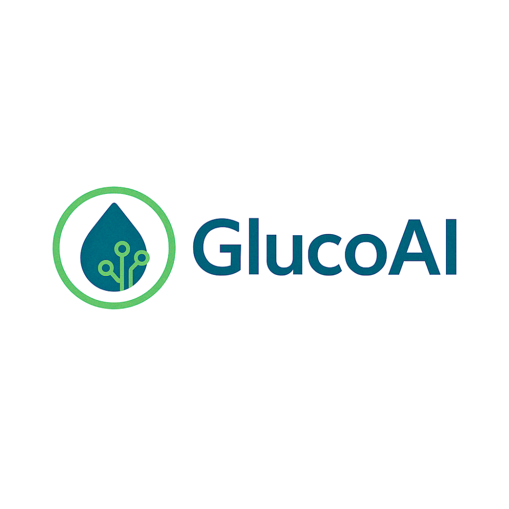
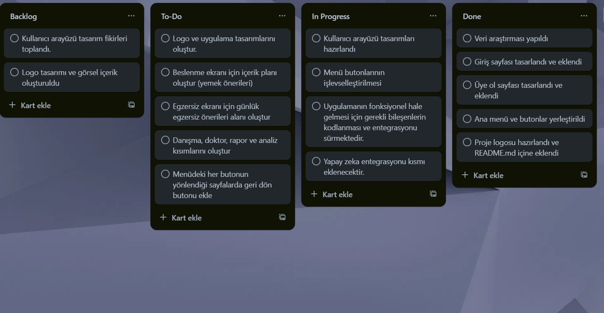

# Takım İsmi 
**Grup-1**

## Takım Üyeleri 

|   NAME           | TİTLE            | Socials |
|------------------|------------------|---------------|
| Hasip Tekin      | Product Owner    |  / 
| Elif Ümran Ölmez | Scrum Master     |  / 
| Aleyna Tunç      | Developer        |  / 
| Süveyda Ezgi Şan | Developer        |  / 
| Furkan Mortaş    | Developer        |  / 

## Ürün İsmi
**GLUCOAI**
## Ürün Logosu

## Product Backlog URL

https://drive.google.com/drive/folders/1xUvcrFHbop9TNE1DP5Gv3VMxIBU6zCvd

## Ürün Açıklaması

Günümüz teknolojisinde diyabet yönetimi artık çok daha kolay ve akıllı hale geliyor. Yeni nesil deri altından kan şekeri ölçümü yapan Bluetoothlu diyabet takip cihazımız, kullanıcının kan şekerini saatlik olarak otomatik ölçer ve gerçek zamanlı olarak mobil uygulamaya aktarır. Bu sayede kullanıcının günlük kan şekeri dalgalanmaları ve genel sağlık durumu sürekli takip altında olur.

Toplanan kan şekeri verileri, gelişmiş yapay zeka algoritmalarıyla analiz edilir. Yapay zeka, bireysel metabolizma ve sağlık geçmişine göre kişiye özel beslenme listeleri, antrenman programları ve sağlık önerileri oluşturur. Böylece diyabet hastaları, kan şekeri seviyelerini stabilize etmek ve yaşam kalitelerini artırmak için bilinçli kararlar verebilir.

Uygulama içinde ayrıca kullanıcılar için gelişmiş bir raporlama sistemi vardır. Bu sistem sayesinde kan şekeri trendleri, risk analizleri ve ilerleme raporları görselleştirilerek sunulur.

Ayrıca, uygulamaya entegre edilen yapay zeka destekli sohbet botu sayesinde hastalar, sağlıklarıyla ilgili merak ettikleri soruları doğrudan uygulama içinden doktorlara sorabilir veya botla hızlıca bilgi alabilirler. Bu özellik, acil durumlarda hızlı geri dönüş ve destek sağlar.

Tüm bu özellikler, diyabet yönetimini kolaylaştırırken, hastaların bağımsızlığını artırır ve kronik hastalıkla yaşamayı daha yönetilebilir kılar.

## Ürün Özellikleri
- Yapay Zeka Destekli Analiz: Toplanan veriler, kullanıcının metabolizmasına ve sağlık geçmişine göre detaylı analiz edilir.

- Kişiye Özel Beslenme Listeleri: Yapay zeka, kan şekeri seviyesine ve kullanıcı alışkanlıklarına göre sağlıklı yemek önerileri sunar.

- Kişiye Özel Antrenman Planları: Diyabet yönetimine uygun egzersiz programları oluşturulur.

- Detaylı Raporlama: Kan şekeri dalgalanmaları, günlük-haftalık-aylık grafikler ve sağlık trendleri görselleştirilir.

- Yapay Zeka Destekli Doktor ve Danışman Sohbeti: Kullanıcıların sağlık sorularını yapay zeka ile hızlı yanıt alma veya doktorlarına iletme imkanı.

- Kullanıcı Dostu Mobil Uygulama: Kolay arayüz, anlık bildirimler, hatırlatıcılar ve sağlık takibi.

- Veri Güvenliği: Tüm sağlık verileri güvenli sunucularda şifreli olarak saklanır.

- Acil Durum Uyarıları: Kan şekeri kritik seviyeye düştüğünde veya yükseldiğinde anında kullanıcıyı ve doktorunu uyarır.

## Hedef Kitle

- Tip 1 ve Tip 2 Diyabet Hastaları: Kan şekeri seviyelerini düzenli takip etmek isteyen herkes.

- Yaşlı ve Orta Yaş Diyabet Hastaları: Özellikle teknoloji kullanımı sınırlı olan, kolay ve pratik çözümler arayan kişiler.

- Diyabet Yönetimi İçin Proaktif Olmak İsteyen Bireyler: Diyet ve egzersizle hastalığını kontrol altında tutmayı amaçlayan aktif kullanıcılar.

- Ailesi veya Bakıcıları Diyabetli Kişiler: Hastalarının durumunu gerçek zamanlı takip etmek isteyen yakınları.

## SPRİNT-1

Sprint süresince ekip iki gruba ayrılarak çalışmalarını yürütmüştür:

1. Grup: Diyabetle ilgili veri setleri araştırılmış, örnek veri setlerine bakılmıştır.

2. Grup: Uygulama geliştirilmeye başlanmış, temel ekranlar ve menü yapısı oluşturulmuştur.

## Sprint İçinde Tamamlanması Tahmin Edilen Puan

✔️ Toplam: 100 Puan

 ## Puan Tamamlama Mantığı

📌 Proje toplamda 300 puanlık iş yükü içerdiğinden, her sprintte yaklaşık 100 puan hedeflenmiştir.

## Sprint 1: 100 Puan

🏁 Tamamlanan Görevler (Toplam: 62 Puan)

Takımla ürün fikirleri bulma – 15 Puan

Scrum sürecinde rollerin belirlenmesi – 15 Puan

Marka renklerinin seçilmesi – 11 Puan

Giriş sayfası oluşturma – 10 Puan

Kayıt sayfası oluşturma – 11 Puan

👩🏻‍💻 Yapılıyor (Toplam: 38 Puan)

UI formu oluşturma – 11 Puan

Ürün detay sayfası arayüzü oluşturma – 10 Puan

Uygulamanın temel ekran yapılarının oluşturulması – 17 Puan

##  Backlog Düzeni ve Story Seçimleri

Bu sprintte aşağıdaki görevler üstlenilmiştir:

📊 Veri setlerinin araştırılması ve incelenmesi

📱 Uygulama arayüzünün tasarlanması ve ilk ekranların oluşturulması

💬 Slack ve WhatsApp üzerinden ekip içi iletişimin sağlanması

## Daily Scrum

-Toplantılar  Slack üzerinden yapılmıştır.
https://drive.google.com/drive/folders/1xUvcrFHbop9TNE1DP5Gv3VMxIBU6zCvd
- Anlık bilgi paylaşımı WhatsApp üzerinden yürütülmüştür.

- Ekipler günlük ilerleme ve sorunlarını paylaşmıştır.

## Sprint Board Güncellemesi

Görev takibi Sprint Board üzerinden yapılmış ve güncellenmiştir.

 ## Ürün Durumu

✅ Projeye uygun örnek veri setleri tespit edilmiştir.

✅ Uygulamanın temel ekranları oluşturulmuştur.

## Sprint Review

- Veri seti araştırmaları tamamlandı ve proje ihtiyaçlarına uygun örnekler seçildi.

- Uygulama geliştirme süreci başlatıldı, ilk ekranlar oluşturuldu.

## Sprint Retrospective

➗ Ekip ikiye ayrılarak çalışmaya devam edecek:

Grup 1: Veri analizi ve yapay zeka tarafına geçiş

Grup 2: Uygulamanın ekran ve işlevselliğinin genişletilmesi

📅 Toplantılar belirli aralıklarla devam edecek.

💬 Slack ve WhatsApp aktif iletişim için kullanılacak.

### Demo Video
https://drive.google.com/file/d/1yYdc7Zpm8PGjQ8YPn0i6W8011YB3STcL/view?usp=drivesdk

## SPRİNT-2

## Sprint Notları

Sprint-2 sürecinde projeye ait arayüz tasarımları genişletilmiş ve önemli modüller sisteme entegre edilmiştir. Kullanıcı deneyimini artıracak yeni özellikler ve destekleyici altyapılar geliştirilmiştir.

✅ Gerçekleştirilen Çalışmalar
Arayüze Eklenen Modüller:

Psikolojik Destek

İlaç Takip

Laboratuvar Sonuçları

Acil Durum

Sağlık Değerlendirmesi

Doktor ile İletişim

Raporlar ve Canlı Durum

İçeriği Oluşturulan Modüller:

Beslenme → Yapay zeka desteği eklendi.

Egzersiz → Yapay zeka desteği eklendi.

Danışma → Chatbot entegrasyonu sağlandı.

Doktor → Kullanıcının sağlık verilerini doktora iletme ve randevu oluşturma fonksiyonu entegre edildi.

Sağlık Değerlendirmesi → Kullanıcı verilerinin analiz edilmesi ve yorumlanması sağlandı.

## Sprint İçinde Tamamlanması Tahmin Edilen Puan

Sprint başında her bir sprint için 100 puan, toplamda 3 sprint için 300 puan hedeflenmiştir.

- Sprint-2 için yaklaşık 100 puanlık görev planlanmıştır

## Tahmin Mantığı
Puanlama, görevlerin zorluk seviyelerine, teknik bilgi gereksinimlerine, belirsizlik durumlarına ve bağımlılıklarına göre belirlenmiştir.

